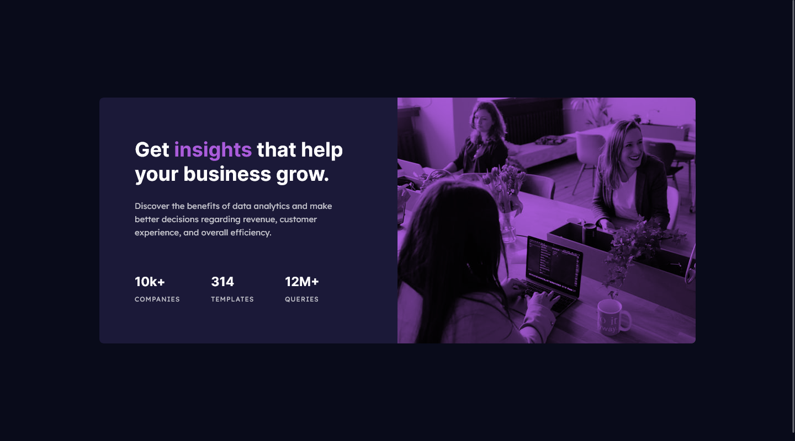
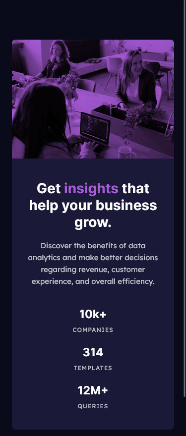

# Frontend Mentor - Stats preview card component solution

This is a solution to the [Stats preview card component challenge on Frontend Mentor](https://www.frontendmentor.io/challenges/stats-preview-card-component-8JqbgoU62). Frontend Mentor challenges help you improve your coding skills by building realistic projects.

## Table of contents

- [Overview](#overview)
  - [The challenge](#the-challenge)
  - [Screenshot](#screenshot)
  - [Links](#links)
- [My process](#my-process)
  - [Built with](#built-with)
  - [What I learned](#what-i-learned)
- [Author](#author)

## Overview

This is a great small challenge to help get you used to building to a design. There's no JS in this project, so you'll be able to focus on your HTML & CSS skills.

### The challenge

Your challenge is to build out this card component and get it looking as close to the design as possible.

Users should be able to:

- View the optimal layout depending on their device's screen size

### Screenshot




### Links

- Solution URL: [https://github.com/mohamedKhaled89/stats-preview-card-component]
- Live Site URL: [https://mohamedkhaled89.github.io/stats-preview-card-component/]

## My process

### Built with

- Semantic HTML5 markup
- CSS custom properties
- Flexbox
- CSS Grid

### What I learned

I used mix-blend-mode to try to reach the main image color

```html
<picture>
  <source media="(min-width:1200px)" srcset="images/image-header-desktop.jpg" />
  <source srcset="images/image-header-mobile.jpg" />
  
</picture>
```

```css
picture {
  position: relative;
}

picture::before {
  position: absolute;
  content: "";
  width: 100%;
  height: 100%;
  mix-blend-mode: multiply;
  background-color: var(--Soft-violet-accent);
}
```

## Author

- Frontend Mentor - [@mohamedKhaled89](https://www.frontendmentor.io/profile/mohamedKhaled89)
